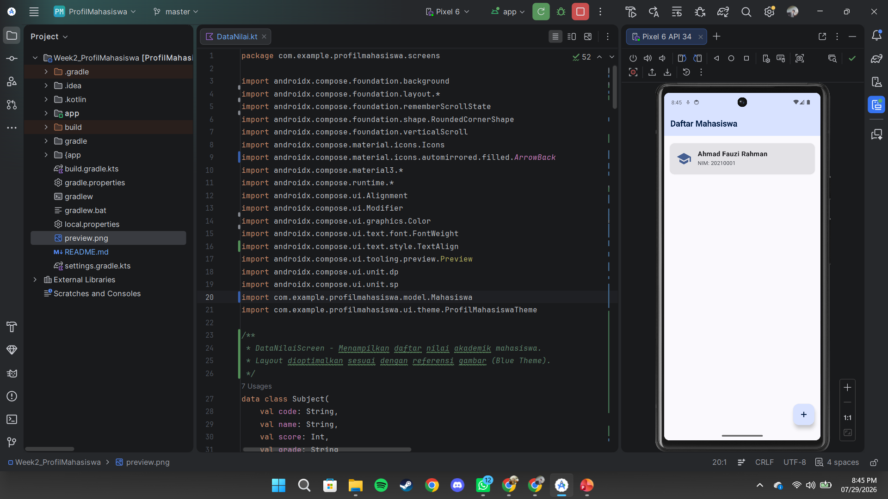

# Aplikasi Profil Mahasiswa

Aplikasi Android berbasis Jetpack Compose untuk mengelola daftar mahasiswa, melakukan pengeditan data, dan melihat nilai akademik.

## Fitur Utama

- **Daftar Mahasiswa (Home)**: Menampilkan list mahasiswa menggunakan `LazyColumn` dengan navigasi ke detail masing-masing.
- **Detail Profil**: Menampilkan informasi lengkap mahasiswa, termasuk statistik akademik dan akses ke data nilai.
- **Tambah Mahasiswa**: Form input untuk menambahkan data mahasiswa baru ke dalam daftar.
- **Edit Profil**: Memungkinkan pembaruan data mahasiswa yang sudah ada (Nama, Jurusan, Email, Telepon, Alamat).
- **Data Nilai**: Menampilkan transkrip nilai akademik mahasiswa tertentu dengan layout tabel yang menarik.

## Perubahan yang Telah Dilakukan (Refaktor Navigation & State)

### 1. Arsitektur & Navigasi
- **Navigation Compose**: Mengimplementasikan `androidx.navigation:navigation-compose` untuk menangani rute antar layar secara profesional.
- **Dynamic Routing**: Mendukung parameter rute seperti `detail/{nim}`, `edit/{nim}`, dan `data_nilai/{nim}`.
- **State Hoisting**: Memindahkan state utama `mahasiswaList` ke `MainActivity` untuk konsistensi data di seluruh aplikasi.

### 2. Persistensi State & Model
- **Parcelable Model**: Mengaktifkan `kotlin-parcelize` pada model `Mahasiswa` agar objek dapat dipertahankan saat terjadi proses sistem (seperti rotasi layar).
- **rememberSaveable**: Menggunakan `rememberSaveable` pada field input form untuk memastikan data yang sedang diketik tidak hilang saat orientasi layar berubah.

### 3. Antarmuka Pengguna (UI) & Material 3
- **Modern Scaffold**: Implementasi `Scaffold` di setiap layar dengan `TopAppBar` yang adaptif dan `FloatingActionButton` untuk aksi tambah data.
- **Lazy Layouts**: Penggunaan `LazyColumn` untuk efisiensi tampilan daftar mahasiswa yang banyak.
- **Dynamic Screens**: Layar Profil, Edit, dan Data Nilai kini mengambil data secara dinamis berdasarkan parameter NIM dari navigasi.

### 4. Logic & Interaction
- **Callback Pattern**: Menggunakan lambda untuk navigasi dan aksi simpan data, memisahkan logika navigasi dari tampilan UI.
- **Update Logic**: Implementasi logika update list mahasiswa menggunakan `mahasiswaList.map` untuk memperbarui data spesifik tanpa merusak list utama.

## Tampilan Aplikasi

## Teknologi yang Digunakan
- **Kotlin**
- **Jetpack Compose** (UI Framework)
- **Navigation Compose** (Routing)
- **Material Design 3** (Design System)
- **Kotlin Parcelize** (State Persistence)
- **Android Studio Ladybug**
